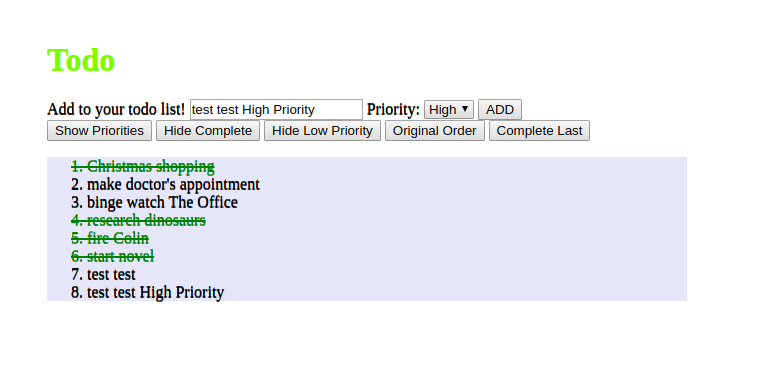

# Todata is a fancy app for your Todo lists

### Screenshot

### Link to hosted website

[Todata Todo App](https://edmontdantes.github.io/todata/)

### Usage

in the input box please add your todo item either with low or high priority.

Please Note that in order to mark todo item complete, you need to press on it in the item list, and in that case the letters are becoming green and crossed out which indicates that they are complete.

there is a row of sorting buttons at the bottom of add feature.
these buttons toggle depending of what kind of sorting you select.

#### Sorting functions
Show/hide Priorities - shows at the end priorities on each todo item

Hide/Show Complete - shows or hides completed items

Show/Hide Low Priority - shows or hides low priority items from the list

High Priority first/Original Order - sorts items where high priority items will be the first ones & original Order

complete Last / Original Order - sorts items where complete items will be at the bottom of the list & original order